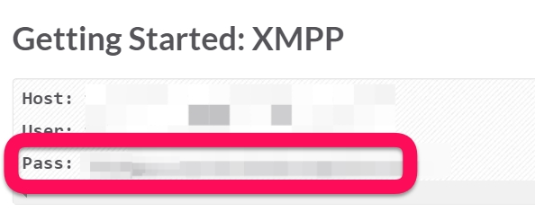

# Robotoyman

`Robotoyman` is a bot for `toyamaprog` on slack using [ruboty](https://github.com/r7kamura/ruboty).

## Requirements

* A [Heroku](https://www.heroku.com/) account.
* Enable [XMPP Gateway](https://my.slack.com/admin/settings) on slack.
* Create a new slack account for `robotoyman`.

## How to customize this bot?

1. Clone this project(`git@github.com:toyamaprog/robotoyman-template.git`) on local. 
1. Edit `Gemfile` or make own plugin for `ruboty`. 
    Ex. [like this commit](https://github.com/toyamaprog/robotoyman-template/commit/5ded9dd520a0a296d7a387d5b8dc810d8f409cae).
1. Git `add` and `commit`.
1. Deploy automatically if you run `git push origin master` to push this repository.

## How to setup?

:memo: This section is intended for use in trouble on a existing bot server. 

### 1. Deploy

Press "Deploy to Heroku" button and fill in a form to deploy Ruboty to heroku.

And update configs as follows from menu on heroku, `Settings` -> `Config Variables` -> Press `Reveal Config Vars` -> Press `Edit`.

* SLACK_PASSWORD: Copy and paste from [the "Gateways" page on slack](https://toyamaprog.slack.com/account/gateways).
    
* SLACK_ROOM: Ex. `general,random` ( Add new room by a comma-separated list, `,` ) 
* SLACK_TEAM: `toyamaprog`
* SLACK_USERNAME: `robotoyman`
* TZ: `Asia/Tokyo`

### 2. Add dyno

Because Heroku doesn't create dyno by default,
you need to add 1 dyno from [dashboard](https://dashboard-next.heroku.com/apps).

